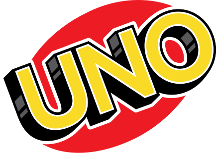
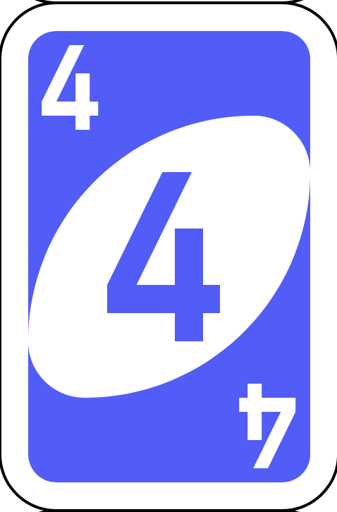

# **UNO**
 
 

 ---

## **Game Description**

#### In 1971, Merle and his son got into a heated debate (or argument) over the official rules of Crazy Eights. To resolve the matter, Merle got to work creating his own game called UNO. UNO in Italian means “one” and so is quite a fitting name. This is because the objective of UNO is to be the first player to get rid of all your cards. When there is just one card remaining in your hand, you need to call “UNO” before anyone notices that you have just one card left. ==Sadly, the functionality the game has been perfected yet and the edition only prints one card to both players and the player with the higher value wins. If tied in value, it's then a tie. Stay tune for more updates very soon==! 

---

## **Tech Stack**

- Javascript 
- HTML
- CSS

---

## **Images Used**

